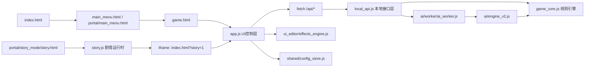

# 鼹鼠棋 Web 项目全功能全函数说明书（2026-02-24）

## 1. 文档目标与读者
- 文档目标：给开发者/主创/对代码不熟的合作人员，提供“当前版本可运行能力 + 代码函数索引 + 模块关系图”。
- 版本基准：仓库当前工作区（生成日期同文件名）。
- 审阅范围：项目自有可读脚本与入口页面。第三方依赖目录（如 `node_modules`）和历史素材目录不纳入主文档维护范围。

## 2. 快速结论
- 已审阅脚本文件：39 个。
- 顶层函数总数：395。
- 类总数：27。
- 类方法总数：244。
- 核心架构：`app.js`(UI) -> `local_api.js`(API适配) -> `game_core.js`(规则引擎)；AI通过 Worker + `ai/engine_v2.js` 执行。

## 3. 总体架构图

## 4. 页面入口与职责
- `index.html`
- `main_menu.html`
- `game.html`
- `portal/main_menu.html`
- `portal/settings.html`
- `portal/story_mode/story.html`
- `portal/story_editor/editor.html`
- `ui_editor/editor.html`
- `mole_chess_portable.html`

说明：`mole_chess_portable.html` 为打包产物，内部内联了主站脚本，调试和开发应以源码文件为准。

## 5. 功能全景（按业务）
- 对局主流程：开局先手骰 -> 首回合死神判定 -> 玩家/AI移动或技能 -> 回合切换 -> 胜负判定。
- 规则核心：多棋子体系（市民/警察/官员/医生/律师/老师/叶某/夜魔/妻子/孩子/死神/鼹鼠/僧侣/魔笛手/广场舞大妈）、墓碑/幽灵池、拘留、修行、命运骰、地道、V阵型。
- 模式能力：PvP、本地PvE、AI vs AI、沙盒摆位、故事模式。
- UI能力：棋盘渲染、右键操作菜单、堆叠选择器、掷骰动画、音效替换、规则指引弹窗、AI调试面板。
- 故事能力：章节节点、条件触发器、战斗节点与iframe联动、V1->V2故事工程迁移。
- 编辑器能力：剧情编辑器、关卡棋盘编辑器、UI主题/特效编辑器。
- 测试能力：P0/P1/P2 分层用例、失败工件采集、复现脚本生成、最近运行汇总、工件保留清理。
- 构建能力：`build_portable.py` 输出单文件离线版本。

## 6. API 接口清单（`local_api.js`）
- `/api/state`：读取完整对局状态快照
- `/api/reset`：重置对局
- `/api/roll_initiative`：先手掷骰
- `/api/start_first_turn`：开始第一回合（触发死神）
- `/api/valid_moves`：查询指定棋子的合法移动
- `/api/move`：执行移动/吃子
- `/api/end_turn`：结束回合并进入下一方起手
- `/api/surrender`：认输
- `/api/undo`：撤销一步
- `/api/upgrade`：市民升变
- `/api/skill`：施放技能
- `/api/ai_move`：AI落子/技能/升变决策并执行
- `/api/ai_debug_decide`：AI只决策不落盘（调试）
- `/api/ai_debug_export_state`：导出序列化状态（调试）
- `/api/sandbox/toggle`：沙盒开关
- `/api/sandbox/relocate`：沙盒摆位
- `/api/sandbox/capture`：沙盒强制吃子
- `/api/story/load_snapshot`：故事模式装载关卡快照
- `/api/story/export_snapshot`：导出当前对局快照
- `/api/story/reset_runtime`：重置故事战斗容器
- `/api/formation_move`：网页模式未实现（固定失败）
- `/api/upload`：网页模式未实现（固定失败）

## 7. AI 子系统说明
- 决策主路径：`/api/ai_move` -> `AIWorkerClient.decide()` -> `ai_worker.js` -> `MoleChessAIEngineV2.decide()`。
- 回退链路：Worker/V2失败时，依次尝试 deterministic fallback、legacy AI、随机兜底。
- 遥测落地：`ai_telemetry_store.js` 记录 fallback、think ms、skill rate、最近50步摘要。
- 配置来源：`ai_config_store.js`（difficulty/timeBudget/nodeBudget/seed/neural/fallback）。

## 8. 测试与运维脚本
- Playwright 测试入口：`npm run test:p0|test:p1|test:p2|test:all`。
- 运行目录：`artifacts/YYYYMMDD/<runId>/`。
- 报告汇总：`node tests-support/reporting/report-last.mjs`。
- 产物清理：`node scripts/prune-artifacts.mjs`。

## 9. 全函数索引（逐脚本）

索引规则：
- “顶层函数”指文件级函数声明（含 async function）。
- “类方法”包含实例方法与静态方法。
- 压缩第三方文件仅做定位，不做内部函数维护索引。

### 9.1 `game_core.js`
- 模块职责：规则引擎核心：棋盘、棋子、技能、回合、胜负、序列化、基础AI（MoleChessAI）。
- 顶层函数（23）：`a2n`, `canCaptureCell`, `canCaptureTargetPiece`, `capture_piece`, `collectPieces`, `create_piece`, `deserializeGame`, `ensureUid`, `fmtPos`, `getPieceType`, `isNightmarePiece`, `isPieceLike`, `isPublicPiece`, `n2a`, `refreshCitizenUpgradeFlags`, `resolveCaptureTargetFromCell`, `roll_for_arrest`, `roll_for_night_day`, `roll_for_possession`, `roll_for_red_song`, `serializeGame`, `serializePiece`, `serializeValue`
- 类（20）：
  - `DiceEngine`（6 方法）：`roll_single`, `roll_double`, `roll_double_with_retry`, `judge_skill`, `judge_with_table`, `withForcedRolls`
  - `Board`（14 方法）：`constructor`, `is_valid_position`, `get_cell`, `get_top_piece`, `add_piece`, `remove_top_piece`, `remove_piece`, `remove_specific_piece`, `move_specific_piece`, `move_piece`, `add_to_ghost_pool`, `clear_cell`, `setup_initial_position`, `toString`
  - `Piece`（4 方法）：`constructor`, `get_valid_moves`, `can_capture`, `toString`
  - `Grave`（2 方法）：`constructor`, `toString`
  - `LifeCycleManager`（5 方法）：`kill`, `banish`, `kill_piece`, `banish_to_ghost_pool`, `resurrect_from_grave`
  - `SkillManager`（6 方法）：`doctor_resurrect`, `police_arrest`, `wife_possess_citizen`, `wife_possess`, `child_learn_red_song`, `teacher_feed`
  - `TransformationManager`（4 方法）：`transform_ye_to_nightmare`, `transform_wife_to_green`, `transform_child_to_red`, `check_all_transformations`
  - `DeathGodManager`（4 方法）：`find_death_god`, `roll_death_god_direction`, `move_death_god`, `random_move`
  - `OfficerManager`（2 方法）：`has_adjacent_officer`, `count_team_officers`
  - `OfficerSkillManager`（2 方法）：`swap_with_piece`, `summon_ghost`
  - `NightmareManager`（4 方法）：`transform_ye_to_nightmare`, `execute_day_night_roll`, `execute_crush_move`, `restore_nightmare_to_ye`
  - `MonkManager`（5 方法）：`_findPieceByUid`, `reconcile_monk_locks`, `release_lock_for_piece`, `save_piece`, `end_save`
  - `MoleManager`（9 方法）：`is_empty_cell`, `is_adjacent8`, `is_cross_line`, `validate_tunnel_path_v2`, `summon_mole`, `dig_tunnel_v2`, `dig_tunnel`, `destroy_grave`, `destroy_all_graves`
  - `SquareDancerManager`（6 方法）：`is_green_wife`, `resolveDirectionDiceForDance`, `findFarthestReachable`, `collectDanceGroup`, `restoreGreenWife`, `vortex_pull`
  - `PoliceManager`（3 方法）：`resolveReleasePosition`, `arrest`, `release_arrested`
  - `CitizenManager`（11 方法）：`citizen_upgrade`, `check_v_formation`, `_find_v_formation`, `_complete_formation`, `move_v_formation`, `check_surround`, `apply_surround_effect`, `is_in_v_formation`, `is_piece_frozen`, `check_formation_after_move`, `update_frozen_status`
  - `LawyerManager`（1 方法）：`is_immune`
  - `PiperManager`（2 方法）：`check_and_cancel_red_song`, `destiny_dice`
  - `Game`（53 方法）：`constructor`, `clone`, `toggle_sandbox`, `get_round_count`, `_findPieceByUid`, `_getPieceFromCell`, `_findAttachedGreenWife`, `_isPieceOnBoard`, `_getPiperSuppressedTeams`, `_isTeamSuppressedByPiper`, `_enforcePiperTerritorySuppression`, `_hasDestinyOverrideForRoll`, `_consumeDestinyOverride`, `_runWithDestinyOverride`, `reconcileGreenWifeCell`, `reconcileGreenWifeComposite`, `_hasActiveGreenWife`, `_hasLearnedRedSongChild`, `_syncTeamProgressFlags`, `_canYeTransform`, `_tryAutoTransformYe`, `_tryAutoTransformYeAll`, `_refreshVFormationBindings`, `_getFormationMembersById`, `evaluateBoard`, `applyMove`, `applyMoveSandbox`, `sandbox_relocate`, `sandbox_capture`, `log_event`, `start_game_after_initiative`, `roll_initiative`, `start_game`, `start_turn`, `end_turn`, `update_states_per_turn`, `update_states_per_round`, `update_states`, `add_skill_cooldown`, `can_use_skill`, `get_skill_cooldown_remaining`, `get_piece_skill_cooldowns`, `add_state_duration`, `can_control_piece`, `can_move_piece`, `can_use_skill_action`, `mark_move_action`, `mark_skill_action`, `get_action_status`, `check_win_condition`, `surrender`, `get_game_state`, `use_skill`
  - `MoleChessAI`（20 方法）：`constructor`, `getBestAction`, `_scoreAction`, `_actionContextBonus`, `_generateActions`, `_generateSkillActions`, `_getOutcomeSpecs`, `_simulateAction`, `_hasAliveChild`, `_childInDeathGodZone`, `_isEnemyPiperInTerritory`, `_getTopPiece`, `_extractTargetPos`, `_targetsDeathGod`, `_getTunnelTargets`, `_predictMolePosForTunnel`, `_getAlignedEmptySquares`, `_doubleToRolls`, `_chebyshevDistance`, `_describeAction`

### 9.2 `local_api.js`
- 模块职责：前端本地API适配层：拦截 fetch(/api/*)，把UI请求转为 Game 对象操作。
- 顶层函数（48）：`actionSignature`, `apiAiDebugDecide`, `apiAiDebugExportState`, `apiAiMove`, `apiEndTurn`, `apiMove`, `apiReset`, `apiRollInitiative`, `apiSandboxCapture`, `apiSandboxRelocate`, `apiSandboxToggle`, `apiSkill`, `apiStartFirstTurn`, `apiState`, `apiStoryExportSnapshot`, `apiStoryLoadSnapshot`, `apiStoryResetRuntime`, `apiSurrender`, `apiUndo`, `apiUpgrade`, `apiValidMoves`, `applyRepeatTelemetry`, `boardToList`, `buildDeterministicRequestId`, `chooseBestForcedUpgrade`, `chooseDeterministicFallbackAction`, `detectPlatformTag`, `digestTrace`, `executeAiAction`, `fallbackRandomMove`, `gameToDict`, `getGame`, `hashString`, `isTeamSuppressedByPiper`, `listUpgradeableCitizens`, `normalizeAiMovePayload`, `parseBody`, `pickDeterministicIndex`, `pieceToDict`, `readAiConfig`, `recordAiDecisionTelemetry`, `resetRepeatTracker`, `respond`, `restoreState`, `runForcedAiUpgrade`, `saveState`, `syncRepeatTracker`, `toValidTeam`
- 类（1）：
  - `AIWorkerClient`（4 方法）：`constructor`, `_nextId`, `_createWorker`, `decide`

### 9.3 `app.js`
- 模块职责：对局UI控制层：渲染、交互、右键菜单、动画、音频、AI回合驱动、故事模式桥接。
- 顶层函数（73）：`animateDiceRoll`, `appendAiLog`, `applyStoryModeUi`, `bridgeLogAndStateEvents`, `canHumanOperateCurrentTurn`, `canOperatePiece`, `canUseRuleBoundActions`, `cellKey`, `checkAiTurn`, `checkAnyOfficerAlive`, `checkCitizenUpgrade`, `checkMobile`, `checkOfficerAlive`, `checkTeacherAlive`, `clearAiLog`, `collectEventsFromLogMessage`, `doMove`, `endTurnAndRefresh`, `ensureStackPicker`, `executeMoleTunnelPath`, `executeSkill`, `fetchState`, `fetchValidMovesForSelection`, `formatPos`, `getAdjacent8EmptyCells`, `getAiModeHint`, `getAiRequestConfig`, `getCaptureTargetsFromMoves`, `getDisplayPiece`, `getDoctorResurrectTargets`, `getLineEmptyCells`, `getPieceFromCellById`, `getPieceNameClass`, `getPoliceArrestTargets`, `getSkillCooldownKey`, `handleSkillChoice`, `hasAliveOfficerForTeam`, `hasCoord`, `hideCitizenUpgradeModal`, `hideContextMenu`, `hideDirectionDice`, `hideProbabilityPanel`, `hideSkillResult`, `hideStackPicker`, `initBoard`, `isSandboxSelectablePiece`, `onCellClick`, `onCellHover`, `playSfx`, `readDefaultAudioSetting`, `readStoryModeSetting`, `refreshAiDebugPanel`, `render`, `resetTunnelFlow`, `restartGame`, `selectUpgrade`, `setPollingPaused`, `setStoryModeSetting`, `setVolume`, `setupAudioUpload`, `showChildProbabilityPanel`, `showContextMenu`, `showDeathGodDice`, `showDirectionDice`, `showDoctorProbabilityPanel`, `showGameOver`, `showPieceInfo`, `showSkillChoiceModal`, `showSkillResult`, `showStackPicker`, `showStatusMessage`, `toggleSandboxMode`, `updateMuteButton`
- 类：无。

### 9.4 `piece_data.js`
- 模块职责：棋子说明文本（用于信息面板展示）。
- 顶层函数：无（或以匿名/回调形式组织）。
- 类：无。

### 9.5 `ai/engine_v2.js`
- 模块职责：AI V2 搜索引擎（迭代深化 + 期望搜索 + 神经特征伪评估 + 循环惩罚）。
- 顶层函数：无（或以匿名/回调形式组织）。
- 类（3）：
  - `SeededRNG`（3 方法）：`constructor`, `nextUint32`, `nextInt`
  - `NeuralEvalRuntime`（12 方法）：`constructor`, `preload`, `evaluateLeaf`, `priorForAction`, `getModelHash`, `getStatus`, `_extractFeatures`, `_pseudoWeight`, `_normalizeHashString`, `_sha256Hex`, `_seedFromArrayBuffer`, `_seedFromString`
  - `MoleChessAIEngineV2`（47 方法）：`constructor`, `setConfig`, `decide`, `_searchRoot`, `_createLearningState`, `_createTeamLearningState`, `_teamLearning`, `_maybeResetLearningMemory`, `_rememberDecision`, `_computeLoopPenalty`, `_computeLearnedBias`, `_isLoopSensitiveAction`, `_evaluateActionExpected`, `_searchNode`, `_quiescence`, `_evaluate`, `_featureTerminalThreat`, `_featureSkillWindow`, `_featureResources`, `_featureRiskControl`, `_countCooldowns`, `_generateActions`, `_getOutcomeSpecs`, `_simulateAction`, `_orderActions`, `_actionHeuristic`, `_applySelectivePruning`, `_isTacticalAction`, `_advanceTurnDeterministic`, `_fallbackAdvance`, `_seedForGame`, `_hashGame`, `_zobristKey`, `_ttKey`, `_isTerminal`, `_terminalScore`, `_hasAliveChild`, `_isEnemyPiperInTerritory`, `_findDeathGod`, `_findChildren`, `_maxDepthByDifficulty`, `_actionSignature`, `_compareActionsStable`, `_chebyshevDistance`, `_now`, `_elapsed`, `_budgetExceeded`

### 9.6 `ai/ai_config_store.js`
- 模块职责：AI参数本地持久化（难度、预算、开关）。
- 顶层函数（11）：`clampInt`, `clone`, `mergeConfig`, `normalizeConfig`, `normalizeDifficulty`, `normalizeEngineVersion`, `readConfig`, `resolveConfig`, `safeGet`, `safeSet`, `writeConfig`
- 类：无。

### 9.7 `ai/ai_telemetry_store.js`
- 模块职责：AI遥测统计（fallback率、思考时延、动作摘要）。
- 顶层函数（11）：`defaultTelemetry`, `detectPlatformTag`, `digestTrace`, `normalizeDecision`, `normalizeTelemetry`, `readTelemetry`, `recordDecision`, `resetTelemetry`, `safeGet`, `safeSet`, `writeTelemetry`
- 类：无。

### 9.8 `ai/worker/ai_worker.js`
- 模块职责：AI Worker 入口，隔离AI计算线程。
- 顶层函数（1）：`safeImport`
- 类：无。

### 9.9 `ai/runtime/ort.min.js`
- 模块职责：第三方压缩运行时；不建议按内部函数进行维护。
- 顶层函数：无（或以匿名/回调形式组织）。
- 类：无。

### 9.10 `shared/config_store.js`
- 模块职责：通用配置存储：布局、故事工程V2、V1迁移、JSON导入导出。
- 顶层函数（18）：`buildNodeFromLegacyScene`, `clampNumber`, `clearLayoutConfig`, `createDefaultStoryProject`, `downloadJson`, `getLayoutConfig`, `getOrMigrateStoryProjectV2`, `getStoryProjectV2`, `migrateLegacyStoryDataV1`, `normalizeLayoutConfig`, `normalizeStoryProjectV2`, `readJson`, `safeLocalStorageGet`, `safeLocalStorageRemove`, `safeLocalStorageSet`, `setLayoutConfig`, `setStoryProjectV2`, `writeJson`
- 类：无。

### 9.11 `portal/main_menu.js`
- 模块职责：主菜单路由与菜单特效触发。
- 顶层函数：无（或以匿名/回调形式组织）。
- 类：无。

### 9.12 `portal/settings.js`
- 模块职责：设置页逻辑：默认音量/静音、布局配置导入导出、故事数据清理。
- 顶层函数（7）：`initAudioSettings`, `readSetting`, `setStatus`, `wireAudioSettings`, `wireDataButtons`, `wireLayoutButtons`, `writeSetting`
- 类：无。

### 9.13 `portal/story_mode/story.js`
- 模块职责：故事模式运行时：节点推进、触发器评估、战斗iframe通信。
- 顶层函数（31）：`applyCommands`, `applyTriggerEffects`, `bind`, `clearChoices`, `countPieces`, `enterNode`, `evaluateCondition`, `handleStoryOp`, `handleStoryState`, `hasPieceAt`, `init`, `loadProject`, `markTriggerRun`, `matchPiece`, `nextNode`, `nextRequestId`, `nodeById`, `playSfx`, `postToBattle`, `prepareBattle`, `renderChapterSelect`, `renderChoices`, `runTriggers`, `setBattleStatus`, `setLine`, `setPortrait`, `setText`, `shouldRunTrigger`, `startBattlePolling`, `startChapter`, `stopBattlePolling`
- 类：无。

### 9.14 `portal/story_editor/editor.js`
- 模块职责：剧情编辑器：章节/节点/关卡/触发器/资源/DSL导入导出。
- 顶层函数（26）：`bind`, `clone`, `ensureChapter`, `ensureProject`, `exportDsl`, `exportProjectJson`, `fillNodeForm`, `fillTriggerForm`, `importDsl`, `importProjectJson`, `init`, `loadFromStore`, `parseJsonField`, `populateNodeChapterSelect`, `removeNodeFromChapters`, `renderAll`, `renderAssetList`, `renderChapterList`, `renderLevelList`, `renderNodeList`, `renderTabs`, `renderTriggerList`, `saveProject`, `setStatus`, `setTab`, `uid`
- 类：无。

### 9.15 `portal/story_editor/board_editor.js`
- 模块职责：嵌入式棋盘关卡编辑器：摆子、堆叠、幽灵池、快照读写。
- 顶层函数（24）：`addGhost`, `addPieceToCell`, `buildSnapshot`, `clearAll`, `clearCell`, `clearSelectedStack`, `cloneBoard`, `createBoardEditor`, `createDescriptor`, `createLayout`, `createOption`, `loadSnapshot`, `moveStack`, `populateGraveOrigin`, `populateSelectors`, `removeStackItem`, `removeTopPiece`, `renderAllCells`, `renderGhostPool`, `renderGrid`, `renderStackList`, `selectCell`, `setStatus`, `updateTeamOptions`
- 类：无。

### 9.16 `ui_editor/editor.js`
- 模块职责：UI主题与特效编辑器：多Surface可视化编辑、快照回滚、导入导出。
- 顶层函数（39）：`applySnapshot`, `applyToPreview`, `bindEvents`, `clone`, `currentEffectsSurface`, `currentSurfaceDef`, `currentThemeSurface`, `defaultEffectsPack`, `defaultEventConfig`, `defaultThemePack`, `elementDef`, `ensureEvent`, `ensureRule`, `exportAll`, `getLS`, `importAll`, `init`, `loadState`, `normalizeEffectsPack`, `normalizeEventConfig`, `normalizeThemePack`, `parse`, `persist`, `postToPreview`, `previewSize`, `refreshPreview`, `renderElements`, `renderEventEditor`, `renderEvents`, `renderProfiles`, `renderPropertyEditor`, `renderSurfaceData`, `renderSurfaceSelect`, `renderVersions`, `resizePreview`, `serializeCss`, `setLS`, `snapshot`, `status`
- 类：无。

### 9.17 `ui_editor/effects_engine.js`
- 模块职责：运行时特效引擎：事件触发、CSS效果、音效、覆盖图。
- 顶层函数（36）：`applyClassEffect`, `applySurfaceTheme`, `applyThemeCss`, `canTriggerByCooldown`, `clamp`, `createFlashOverlay`, `cssForSurface`, `defaultEffectsPack`, `defaultEventConfig`, `defaultThemePack`, `detectSurface`, `ensureStyleElement`, `getConfig`, `getEventConfigForTrigger`, `getSurfaceEvents`, `handleEditorMessage`, `init`, `installBaseEffectStyles`, `normalizeEffectsPack`, `normalizeEventConfig`, `normalizeThemePack`, `playLoopBgm`, `playOneShotAudio`, `readJson`, `readThemeCss`, `resetConfig`, `resolveEventCandidates`, `runOverlayPreset`, `safeGet`, `safeRemove`, `safeSet`, `sanitizeLegacyConfig`, `setEffectsPack`, `setThemePack`, `showOverlayImage`, `triggerEvent`
- 类：无。

### 9.18 `test_coords.js`
- 模块职责：坐标转换快速验证脚本。
- 顶层函数：无（或以匿名/回调形式组织）。
- 类：无。

### 9.19 `scripts/prune-artifacts.mjs`
- 模块职责：测试产物保留策略清理脚本。
- 顶层函数（2）：`collectRuns`, `runHasFailure`
- 类：无。

### 9.20 `tests-support/runner/runtime.mjs`
- 模块职责：测试运行上下文与工具函数。
- 顶层函数（10）：`buildRunId`, `ensureDir`, `formatDatePart`, `formatTimestampPart`, `getRunContextFromEnv`, `percentile`, `resolveFileUrl`, `sanitizeName`, `sha1Of`, `stableJson`
- 类：无。

### 9.21 `tests-support/runner/test-base.mjs`
- 模块职责：Playwright 测试基类夹具（mc对象注入）。
- 顶层函数：无（或以匿名/回调形式组织）。
- 类：无。

### 9.22 `tests-support/runner/logger.mjs`
- 模块职责：测试过程日志/事件/失败复现脚本采集。
- 顶层函数（2）：`appendJsonl`, `nowIso`
- 类（1）：
  - `CaseLogger`（11 方法）：`constructor`, `attachPage`, `noteError`, `rawApi`, `fetchState`, `callApi`, `setForcedRolls`, `captureFailureArtifacts`, `writeReproScript`, `assertPerfBudgets`, `finalize`

### 9.23 `tests-support/runner/global-setup.mjs`
- 模块职责：全局setup：创建本次测试run目录与元数据。
- 顶层函数（1）：`globalSetup`
- 类：无。

### 9.24 `tests-support/runner/game-helpers.mjs`
- 模块职责：测试辅助查找与选步函数。
- 顶层函数（8）：`adjacent8`, `chooseSimpleMove`, `findFirstEmptyAdjacent`, `findFirstLineEmpty`, `findPiece`, `findPieces`, `isEmpty`, `lineCells`
- 类：无。

### 9.25 `tests-support/runner/error-classifier.mjs`
- 模块职责：错误分类器。
- 顶层函数（1）：`classifyError`
- 类：无。

### 9.26 `tests-support/reporting/report-last.mjs`
- 模块职责：最近一次测试汇总报告生成器。
- 顶层函数（1）：`listRunDirs`
- 类：无。

### 9.27 `tests-e2e/p0.ui-smoke.spec.mjs`
- 模块职责：P0 UI冒烟测试。
- 顶层函数：无（或以匿名/回调形式组织）。
- 类：无。

### 9.28 `tests-api/p0.core-flow.spec.mjs`
- 模块职责：P0 核心流程API测试。
- 顶层函数：无（或以匿名/回调形式组织）。
- 类：无。

### 9.29 `tests-api/p1.boundary.spec.mjs`
- 模块职责：P1 边界条件测试。
- 顶层函数：无（或以匿名/回调形式组织）。
- 类：无。

### 9.30 `tests-api/p1.mole-piper.spec.mjs`
- 模块职责：P1 鼹鼠/魔笛手复杂机制测试。
- 顶层函数（9）：`advanceToTeam`, `createGrave`, `ensureTurnReady`, `findCitizenCaptureSetup`, `findEmptyInRows`, `findStableEmpty`, `findTunnelRoute`, `isActionReady`, `setupGame`
- 类：无。

### 9.31 `tests-api/p2.soak.spec.mjs`
- 模块职责：P2 AI对弈稳定性浸泡测试。
- 顶层函数（1）：`updateRepeat`
- 类：无。

### 9.32 `build_portable.py`
- 模块职责：单文件便携包构建器（内联HTML/CSS/JS/资源）。
- 顶层函数（2）：`file_to_base64`, `pack_game`
- 类：无。

### 9.33 `ai_training/generate_data.py`
- 模块职责：训练样本占位数据生成。
- 顶层函数（2）：`build_sample`, `main`
- 类：无。

### 9.34 `ai_training/train.py`
- 模块职责：策略价值网络训练脚手架（PyTorch）。
- 顶层函数（1）：`main`
- 类（1）：
  - `PolicyValueNet`（2 方法）：`__init__`, `forward`

### 9.35 `ai_training/export_onnx.py`
- 模块职责：训练模型导出ONNX。
- 顶层函数（1）：`main`
- 类（1）：
  - `PolicyValueNet`（2 方法）：`__init__`, `forward`

### 9.36 `ai_training/evaluate.py`
- 模块职责：评测报告脚手架。
- 顶层函数（1）：`main`
- 类：无。

### 9.37 `tests/ai_consistency_runner.py`
- 模块职责：跨设备AI一致性回归脚本。
- 顶层函数（2）：`action_signature`, `main`
- 类：无。

### 9.38 `tests/ai_loop_regression.py`
- 模块职责：AI回合循环重复性/多样性回归脚本。
- 顶层函数（3）：`choose_context`, `main`, `update_repeat_streak`
- 类：无。

### 9.39 `playwright.config.ts`
- 模块职责：Playwright测试总配置。
- 顶层函数：无（或以匿名/回调形式组织）。
- 类：无。

## 10. 协作建议（给不熟代码的合作人员）
- 想改规则：优先看 `game_core.js` 的 `Game`、`SkillManager`、对应棋子类。
- 想改前端交互：优先看 `app.js`；样式在 `style.css` / `pc98_override.css`。
- 想改AI：先看 `ai/engine_v2.js` 与 `local_api.js` 的 `/api/ai_move`。
- 想改剧情系统：先看 `shared/config_store.js`（数据结构）+ `portal/story_mode/story.js`（运行时）+ `portal/story_editor/editor.js`（编辑器）。
- 想加测试：按 `tests-api` / `tests-e2e` 的 P0-P2 分层方式补用例。